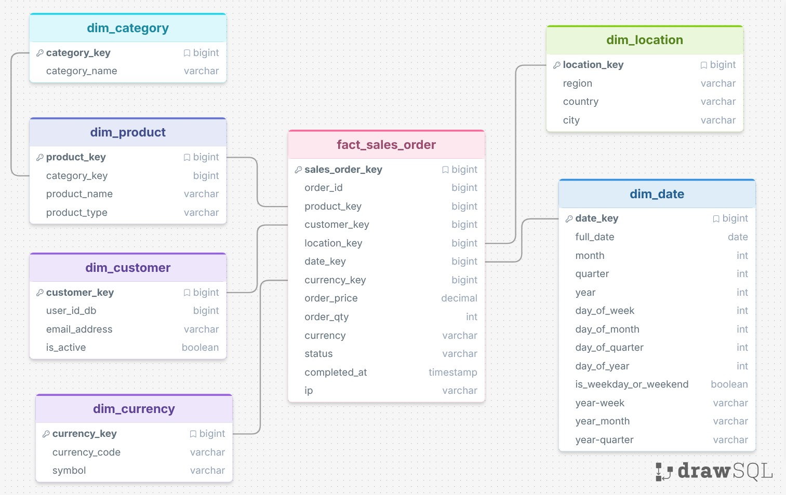

  <h1><strong>Glamira E-commerce Analytics Pipeline Project</strong></h1>

## Overview 
The Glamira E-commerce Analytics Platform is an end-to-end Data Engineering project designed to process, transform, and analyze large-scale e-commerce behavioral and transactional data.

This project simulates a real-world modern data platform using cloud-native technologies and industry-standard data engineering practices including:

The diagram above illustrates the full processes: 
- Batch ETL/ELT pipelines
- Cloud Data Lake architecture
- BigQuery Data Warehouse
- Dimensional Data Modeling
- dbt transformations
- Data quality validation
- Business Intelligence dashboards

The platform processes more than 41 million MongoDB event records and transforms raw semi-structured data into analytical datasets for business reporting and insights.

## Data Architecture

The platform follows a modern Medallion-style architecture:

  

## Data Modeling

  

## Dashboard and Reporting 

## Conclusion
This project is intended for educational, portfolio, and learning purposes.
